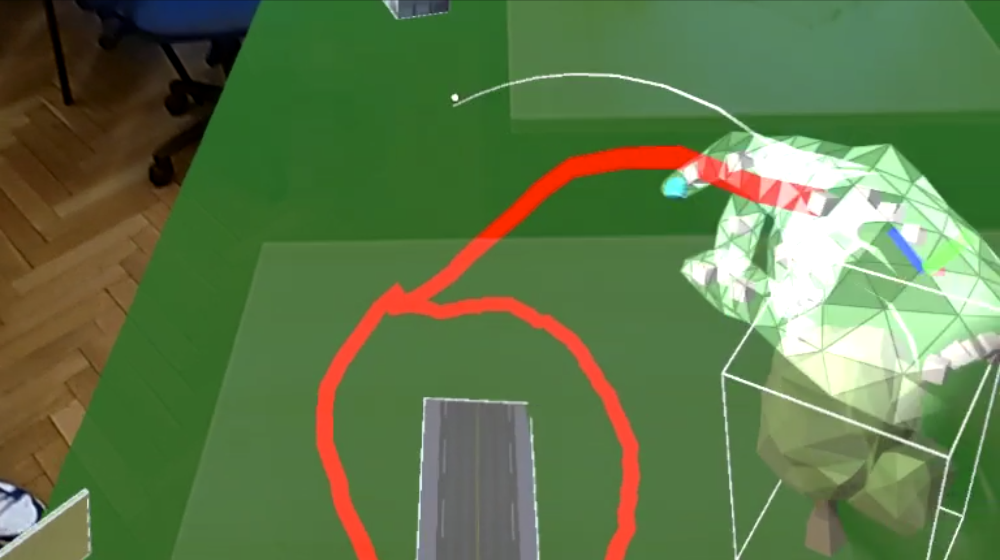
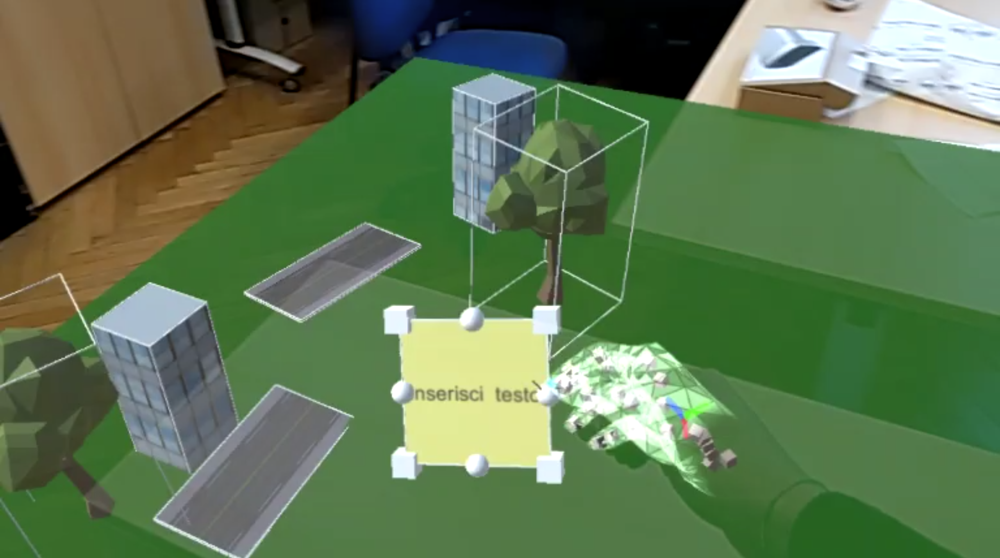
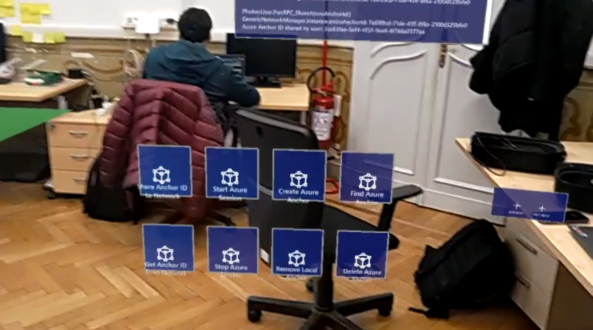
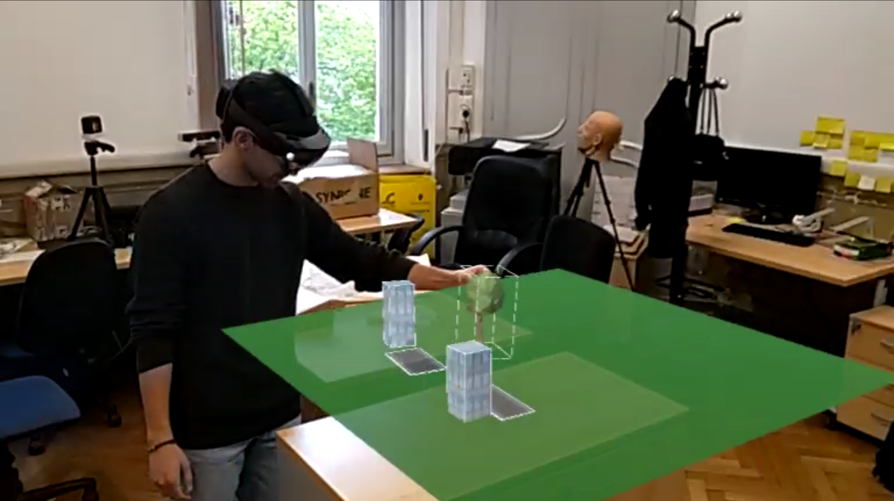

# Sharing of an environment in AR (Hololens2)

Our research activity was focused on the study of techniques to allow two users to interact in a shared AR space with the ability to communicate and make changes in real-time. Through a research path characterized by many attempts and failures, we created a prototype of a real-time sharing application of the same work environment that allows the two users to manipulate the same objects and communicate through an interactive writing system. The application was developed using the Unity engine and implemented for Hololens 2.

Project developed for the Image Processing and Computer Vision course at the Polytechnic University of Turin (AA 2022/23), at the 3DLab (https://3dlab.polito.it)

### Drawing

    

### Models

    

### ASA menu

    

### Sharing between users

    

### Videos recorded with Hololens2 
[Video 1](https://github.com/ciroanni/imageprocessing_project/video/20240423_165721_HoloLens.mp4)

[Video 2](https://github.com/ciroanni/imageprocessing_project/video/20240423_165722_HoloLens.mp4)

## References
[1]	Mert Usta, Drawer Hololens2 Unity, https://github.com/mertusta1996/Drawer-Hololens2-Unity 

[2]	Photon Engine, PUN2 in Unity Asset Store, https://www.photonengine.com/gaming 

[3]	Microsoft Azure Spatial Anchor, https://azure.microsoft.com/en-us/products/spatial-anchors

[4]	Mikkeline Elleby, Bachelor Project collaborative MR AR with PUN and ASA, https://github.com/mikkeline-elleby/Bachelor-Project-collaborative-MR-AR-with-PUN-and-ASA.git
